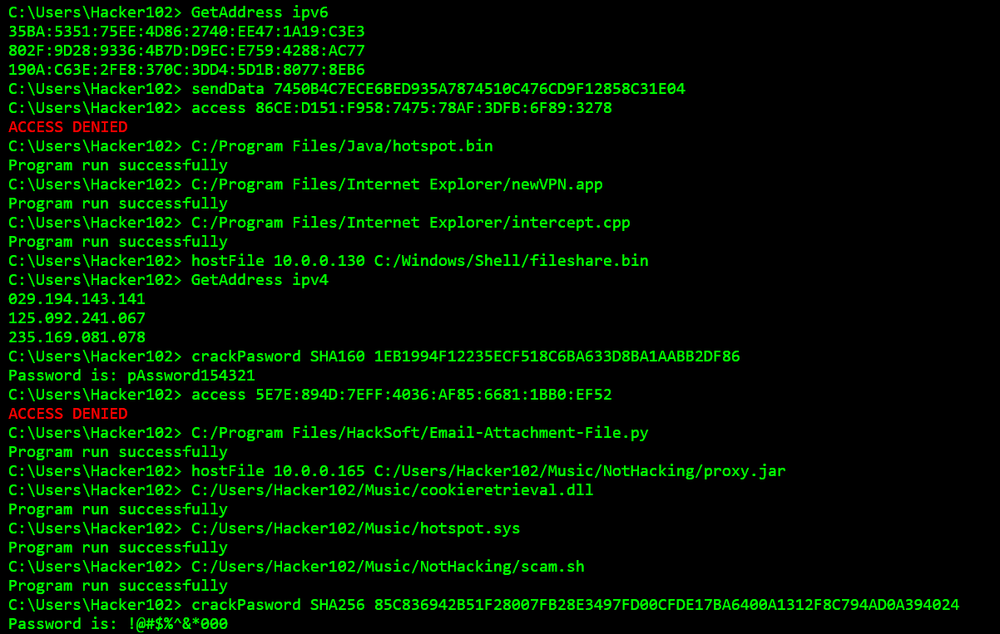

<!-- A live example is not possible to display because GitHub blocks it. -->

## HackerGenerator
HackerGenerator is a generation function written in JavaScript that prints hacking similar to how pop culture portrays it. Hacker Generator is entirely satirical and its main goal is not accuracy.

Hacker Generator is available at https://unfit-donkey.github.io/HackerGenerator

See [CONTRIBUTING.md](CONTRIBUTING.md) for guides on how you can help.

HackerGenerator is under the MIT license

## Installation
To test your changes, open the HTML file in your browser.

